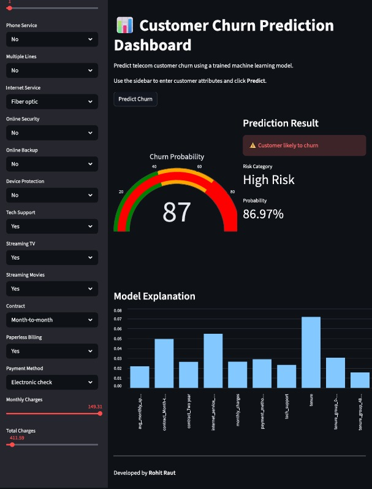
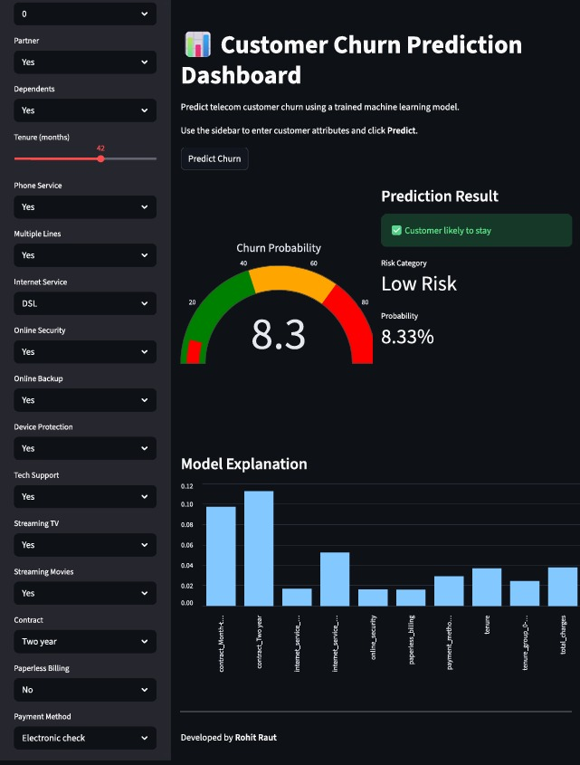

# 📊 Customer Churn Prediction System

[](https://www.python.org/)
[](https://scikit-learn.org/)
[](https://streamlit.io/)
[](LICENSE)

[](https://customer-churn-prediction-system-by-rohit-raut.streamlit.app/)

Built with **Python, Scikit-learn, Pandas, SHAP, Plotly, and Streamlit**, this project demonstrates the **End-to-end machine learning pipeline:**

**Raw Dataset → EDA → Data Cleaning → Feature Engineering → Train-Test Split → Model Training → Model Evaluation → Model Explainability → Model Deployment (Streamlit App).**

---

## 🌐 Live Application

🔗 **Try the deployed application**

https://customer-churn-prediction-system-by-rohit-raut.streamlit.app/

This interactive dashboard allows users to input telecom customer details and instantly predict the **probability of churn** along with **model explanations**.

---

## 🚀 Project Overview

- **Objective:** Predict whether a telecom customer is likely to churn.
- **Dataset:** [IBM Telco Customer Churn Dataset (Kaggle)](https://www.kaggle.com/datasets/blastchar/telco-customer-churn)
- **ML Pipeline:** EDA, Data cleaning, feature engineering, model training, evaluation, explainability
- **Deployment:** Interactive **Streamlit ML dashboard**.
- **Best Model:** XGBoost
- **Best ROC-AUC Score:** **0.848**

---

## 📊 Dataset Information

Dataset Source:

> IBM Telco Customer Churn Dataset (Kaggle)

**Dataset Size**

| Metric | Value |
|------|------|
Rows | **7043**
Columns | **21**

---

## ⚙️ Machine Learning Pipeline

This project follows a **complete ML workflow**.

```
            Raw Dataset
                ↓
           Data Cleaning
                ↓
        Feature Engineering
                ↓
         Feature Encoding
                ↓
     Train/Test Split (80/20)
                ↓
          Model Training
                ↓
         Model Evaluation
                ↓
        Model Explainability
                ↓
     Streamlit Web Application
```


---

## 🧹 Data Cleaning

Key preprocessing steps performed:

- Removed non-predictive identifier columns
- Standardized column names to **snake_case**
- Converted categorical values to consistent formats
- Fixed incorrect data types
- Converted target variable **churn → binary (0/1)**

---

## 🏗 Feature Engineering

Additional features were created to improve model performance.

### 1️⃣ Tenure Group

Customers grouped into lifecycle stages.

- ```0-12 months```
- ```12-24 months```
- ```24-48 months```
- ```48+ months```


Captures **customer lifecycle behaviour**.

---

### 2️⃣ Services Count

Counts number of subscribed services.

- ```services_count = sum(service features)```


Higher engagement → **lower churn probability**.

---

### 3️⃣ Average Monthly Spend

- ```avg_monthly_spend = total_charges / tenure```


Captures **spending behaviour patterns**.

---

## 🔢 Feature Encoding

### Binary Encoding

- ```Yes → 1```
- ```No → 0```


Applied to:

- partner
- dependents
- phone_service
- online_security
- online_backup
- device_protection
- tech_support
- streaming_tv
- streaming_movies
- multiple_lines
- paperless_billing

---

### One-Hot Encoding

Applied to multi-category features:

- internet_service
- contract
- payment_method
- tenure_group

---

## 🤖 Model Training

Multiple machine learning models were trained.

| Model | Type |
|------|------|
| Logistic Regression | Linear Model |
| Decision Tree | Tree-Based Model |
| Random Forest | Ensemble Learning |
| Gradient Boosting | Boosting Model |
| XGBoost | Advanced Boosting Model |

---

### Model Performance

All trained machine learning models were Evaluated.

| Model | Accuracy | Precision | Recall | F1 Score | ROC-AUC |
|------|------|------|------|------|------|
| Logistic Regression | 0.805 | 0.675 | 0.509 | 0.581 | 0.847 |
| Random Forest | 0.797 | 0.649 | 0.509 | 0.571 | 0.842 |
| Gradient Boosting | 0.807 | 0.681 | 0.512 | 0.585 | 0.842 |
| XGBoost | **0.769** | 0.545 | 0.774 | 0.639 | **0.848** |
| Decision Tree | 0.753 | 0.523 | 0.774 | 0.624 | 0.835 |


---

## 🏆 Best Model

**XGBoost Classifier**

Performance:

| Metric | Score |
|------|------|
Accuracy | **0.769**
Precision | **0.545**
Recall | **0.774**
F1-Score | **0.639**
ROC-AUC | **0.848**

XGBoost achieved the best balance between **accuracy and generalization**.

---

## 🔍 Model Explainability

The project includes **model explainability using SHAP**.

This helps understand **why the model predicts churn**.

Features influencing predictions include:

- Contract type
- Tenure
- Internet service type
- Monthly charges
- Technical support
- Service subscriptions

The deployed dashboard displays **feature importance for each prediction**.

---

## 🖥 Streamlit Dashboard

The trained ML model is deployed as an **interactive web application** using Streamlit.

### Dashboard Features

- Interactive **customer input form**
- **Churn probability gauge**
- **Risk classification (Low / Medium / High)**
- **SHAP-based prediction explanation**
- Clean and responsive **ML dashboard UI**

---

## 📸 Application Screenshots

### High Risk Prediction



---

### Low Risk Prediction



---

## 📊 Risk Classification

| Probability | Risk Level |
|-------------|------------|
0 – 40% | Low Risk
40 – 70% | Medium Risk
70 – 100% | High Risk

---

## 🗂 Project Structure

```bash

customer_churn_prediction_system
│
├── .venv/
│
├── data/
│   ├── raw_data/
│   │   	└── raw_telco_churn_data.csv
│   │
│   ├── transformed_data/
│   │   	├── cleaned_data.csv
│   │   	└── transformed_data.csv
│   │
│   └── model_input/
│       	├── x_train.csv
│       	├── x_test.csv
│       	├── y_train.csv
│       	└── y_test.csv
│
├──  notebooks/
│       	├── 01_initial_eda_before_data_cleaning.ipynb
│       	├── 02_eda_after_data_cleaning.ipynb
│       	└── 03_eda_after_feature_engineering.ipynb
│
├──  saved_models/
│   		├── 01_logistic_regression_model.pkl
│   		├── 02_decision_tree_model.pkl
│       	├── 03_random_forest_model.pkl
│       	├── 04_gradient_boosting_model.pkl
│       	├── 05_xgboost_model.pkl
│       	└── best_churn_prediction_model.pkl
│
├───  src/
│   		├── data_cleaning.py
│   		├── feature_engineering.py
│   		├── train_test_split.py
│       	│
│   		├──  models_training/
│   		│		├── __init__.py
│   		│		├── logistic_regression_model.py
│   		│		├── decision_tree_model.py
│   		│		├── random_forest_model.py
│   		│		├── gradient_boosting_model.py
│   		│		└── xgboost_model.py
│		    │
│   		├── models_evaluation/
│   		│		└── evaluate_models.py
│       	│
│           └── train_models.py
│
├──  reports/
│   		├── figures/
│   		└── model_comparison.csv
│
│
├──  streamlit/
│   		├── app.py
│   		├── components/
│   		│		└── prediction_ui.py
│   		│
│   		├── saved_models/
│       	│		├── best_churn_prediction_model.pkl
│       	│		└── training_columns.pkl
│           │
│   		└── utils/
│       			├── model_loader.py
│       			├── preprocessing.py
│       			└── prediction.py
│
├── .gitignore
│
├── LICENSE
│
├── requirements.txt
│
├── requirements-dev.txt
│
└── README.md

```


---

## 🛠 Tech Stack

**Programming**

- Python

**Data Processing**

- Pandas
- NumPy

**Machine Learning**

- Scikit-learn
- XGBoost

**Visualization**

- Plotly
- Matplotlib
- SHAP

**Web Application**

- Streamlit

---

## 🚀 Run Locally

Clone repository:

```bash
git clone https://github.com/rohit-1024/customer-churn-prediction-system.git
```

Navigate to project directory:

```bash
cd customer-churn-prediction-system
```

Create Python Virtual Environment:

```bash
python -m venv .venv
```

Upgrade pip:

```bash
python -m pip install --upgrade pip
```

Install dependencies:

```bash
pip install -r requirements-dev.txt
```

Run App Locally:

```bash
streamlit run streamlit/app.py
```

---

## ☁ Deployment

The application is deployed on **Streamlit Community Cloud**.

### Deployment Steps

1. Push the project to GitHub
2. Connect the repository to **Streamlit Community Cloud**
3. Set the app entry point as:

```bash
streamlit/app.py
```
---

## 🤝 Contribution
Contributions are welcome!
Feel free to fork this repo and submit pull requests.

---

## 📜 License
This project is licensed under the **MIT License**.

---

## 👨‍💻 Author
- **Rohit Raut**
- 📧 [rohit.it4368@gmail.com](mailto:rohit.it4368@gmail.com)
- 🔗 [LinkedIn](https://www.linkedin.com/in/rohitraut1024/)

---
